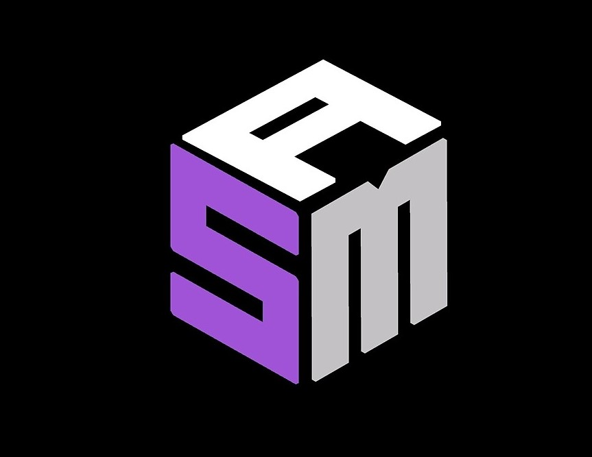

<h1 align="center">
   
  
   
   
  Samuel Dias
</h1>

  Site portfólio, criado com o intuito de apresentar de forma completa e exemplificada toda a minha trajetória e conhecimentos adquiridos como web developer. (Front end)

  

/* Gif aqui com 'screen to gif' */

## 🚀 Technologies

This project was developed with the following technologies:

- ✔ Typescript
- ✔ ReactJS
- ✔ React Hooks
- ✔ Redux
- ✔ Styled-components
- ✔ React Spring
- ✔ Polished
- ✔ Leaflet
- ✔ Lottie
- ✔ Axios

 

## ⚙ Configuração

1º - Para instalar as dependências:

  
yarn

2º - Para iniciar a aplicação:

  
yarn start

 

Made with ♥ by Samuel Dias :wave: [Get in touch!](https://www.linkedin.com/in/samuel-dias-43b931173)
